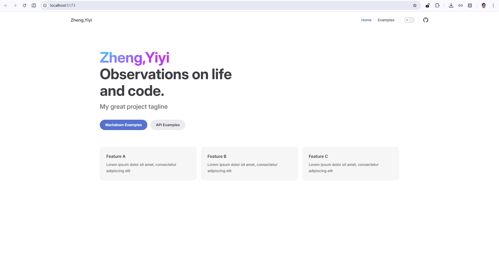

# Getting Started

## Setup

First, run this command to install the dependencies:  `npm add -D vitepress@next`

```shell
C:\github-repo\zheng-yi-yi.github.io>npm add -D vitepress@next

added 104 packages in 22s

37 packages are looking for funding
  run `npm fund` for details
```

Next, start the wizard by running: `npx vitepress init`

```shell
C:\github-repo\zheng-yi-yi.github.io>npx vitepress init

T  Welcome to VitePress!
|
o  Where should VitePress initialize the config?
|  ./docs
|
o  Where should VitePress look for your markdown files?
|  ./docs
|
o  Site title:
|  Zheng,Yiyi
|
o  Site description:
|  Observations on life and code.
|
o  Theme:
|  Default Theme + Customization
|
o  Use TypeScript for config and theme files?
|  Yes
|
o  Add VitePress npm scripts to package.json?
|  Yes
|
o  Add a prefix for VitePress npm scripts?
|  Yes
|
o  Prefix for VitePress npm scripts:
|  docs
|
—  Done! Now run npm run docs:dev and start writing.

Tips:
- Make sure to add docs/.vitepress/dist and docs/.vitepress/cache to your .gitignore file.
- Since you've chosen to customize the theme, you should also explicitly install vue as a dev dependency.
```

Create a `.gitignore` file:

```tex
# dependency package
node_modules/
dist/
.temp/
.cache/

# VitePress-specific build output
docs/.vitepress/dist
docs/.vitepress/cache
docs/.vitepress/.temp

# log files
npm-debug.log*
yarn-debug.log*
yarn-error.log*
pnpm-debug.log*

# editor-related
.vscode/
.idea/
*.suo
*.ntvs*
*.njsproj
*.sln
*.sw?

# OS temporary files
.DS_Store
Thumbs.db

# environment variables (in case you use API keys later)
.env
.env.local
.env.development.local
.env.test.local
.env.production.local
```

## Structure 

The generated file structure is:

```shell
.
├─ docs
│  ├─ .vitepress
│  │  └─ config.js
│  ├─ api-examples.md
│  ├─ markdown-examples.md
│  └─ index.md
└─ package.json
```

The `docs` directory is considered the **project root** of the VitePress site. The `.vitepress` directory is a reserved location for VitePress' config file, dev server cache, build output, and optional theme customization code.

Markdown files outside the `.vitepress` directory are considered **source files**.

VitePress uses **file-based routing**: each `.md` file is compiled into a corresponding `.html` file with the same path. For example, `index.md` will be compiled into `index.html`, and can be visited at the root path `/` of the resulting VitePress site.

> VitePress also provides the ability to generate clean URLs, rewrite paths, and dynamically generate pages. These will be covered in the [Routing Guide](https://vitepress.dev/guide/routing).

## Dev

The `docs:dev` script will start a local dev server with instant hot updates:

```shell
C:\github-repo\zheng-yi-yi.github.io>npm run docs:dev

> docs:dev
> vitepress dev docs


  vitepress v2.0.0-alpha.17

  ➜  Local:   http://localhost:5173/
  ➜  Network: use --host to expose
  ➜  press h to show help
```

The dev server should be running at `http://localhost:5173`. Visit the URL in your browser to see your new site in action!



> More command line usage is documented in the [CLI Reference](https://vitepress.dev/reference/cli).

## Build and Preview

Before deploying, you can build your site and preview it locally to ensure everything is correct.

### Build the Project
Run this command to build the production site:
```shell
npm run docs:build
```
The output will be generated in `docs/.vitepress/dist`.

### Preview Locally
Preview the build locally:
```shell
npm run docs:preview
```
This will start a local server at `http://localhost:4173` to test the production build.

## Deploy

To deploy your site to GitHub Pages, follow these steps:

### 1. Configure GitHub Actions

Create a workflow file at `.github/workflows/deploy.yml`:

```yaml
name: Deploy VitePress site to Pages

on:
  push:
    branches: [main]
  workflow_dispatch:

permissions:
  contents: read
  pages: write
  id-token: write

concurrency:
  group: pages
  cancel-in-progress: false

jobs:
  build:
    runs-on: ubuntu-latest
    steps:
      - name: Checkout
        uses: actions/checkout@v4
        with:
          fetch-depth: 0
      - name: Setup Node
        uses: actions/setup-node@v4
        with:
          node-version: 20
          cache: npm
      - name: Install dependencies
        run: npm install
      - name: Build with VitePress
        run: npm run docs:build
      - name: Upload artifact
        uses: actions/upload-pages-artifact@v3
        with:
          path: docs/.vitepress/dist

  deploy:
    environment:
      name: github-pages
      url: ${{ steps.deployment.outputs.page_url }}
    needs: build
    runs-on: ubuntu-latest
    name: Deploy
    steps:
      - name: Deploy to GitHub Pages
        id: deployment
        uses: actions/deploy-pages@v4
```

### 2. Enable GitHub Pages

1. Go to your repository settings on GitHub.
2. Select **Pages** from the sidebar.
3. Under **Build and deployment > Source**, select **GitHub Actions**.

### 3. Push and Deploy

Push your changes to the `main` branch. GitHub Actions will automatically build and deploy your site to `https://zheng-yi-yi.github.io/`.

